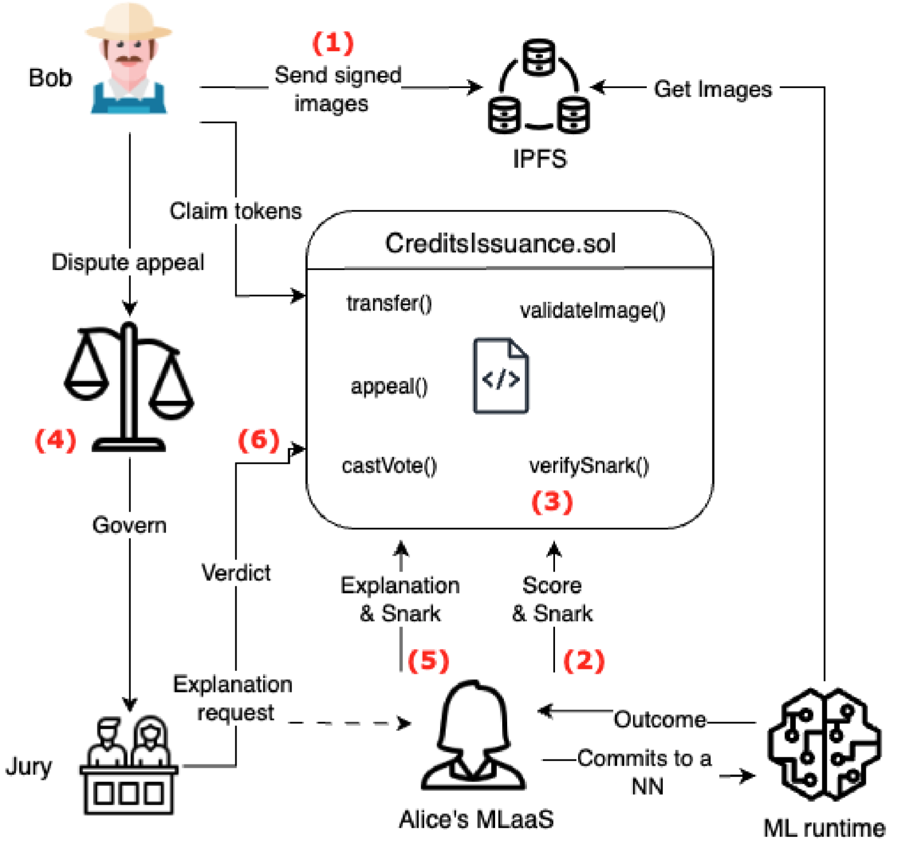
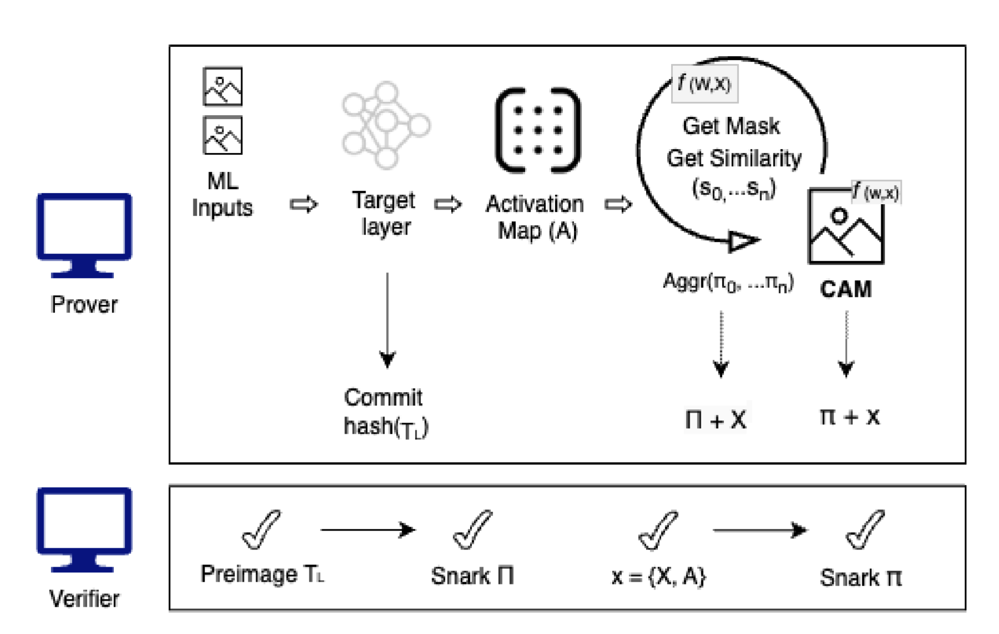

# explainbale AI-based oracle prototype

This repository contains the prototype described in the paper *Cognitive Oracles: On-chain explainable machine learning*. It demonstrates a hybrid oracle that verifies ML inference (and explanations) via SNARKs and lets a smart contract gate rewards (e.g., carbon credits) on valid proofs: 

<p align="center">
  
</p>

The repo includes Solidity contracts, a Hardhat deploy/test flow, and a prover pipeline with ONNX models and precomputed proofs.
- The Solidity **CarbonCreditsContract** emits `ProofSubmitted` and has `claimCredits(bytes proof, uint256[] instances)` which requires a successful call to the verifier’s `verifyProof`. 
- The included **Halo2Verifier** artifact exposes `verifyProof(bytes, uint256[]) → bool`. (ABI + bytecode are already present under `artifacts/`)

---

## Prerequisites

- **Node.js ≥ 18** and **pnpm** or **npm**
- **Python 3.10+** (recommended)  
  Create a venv and install the prover deps (includes ezkl==11.4.1, onnxruntime, torch==2.2.2, etc):
  ```bash
  python -m venv .venv && source .venv/bin/activate
  pip install -r requirements.txt

Note: You don’t need to compile to run the local demo because the verifier artifact is already checked in. Compiling will try to rebuild contracts and may wipe artifacts if sources aren’t present. Use the quickstart below first.

---

## Quickstart

**Install Node deps**

`npm install`


**Start a local Hardhat node**

`npx hardhat node`

**Deploy the contracts (in a new terminal)**

`npx hardhat run scripts/deploy.ts --network localhost`


This deploys:

Halo2Verifier (reads ABI/bytecode from artifacts/contracts/Verifier.sol/Halo2Verifier.json)

CarbonCreditsContract which references the deployed verifier.

**Submit a real proof + claim credits**

`npx hardhat test test/testProofs.ts --network localhost`

The test loads prover/evmInputs.json and calls:

`creditsAttestation.claimCredits(proof, instances);`

## What’s inside the prover

*Models*: ONNX graphs under prover/outputs/dnn/ (e.g., model460.onnx) and CAM-related models under prover/outputs/cam/

*Calibration/Settings:* `prover/outputs/dnn/settings.json` (KZG commitment, `logrows`, visibility, required lookups).

*Precomputed proofs*: `proof460.json` / `proof23k.json` and matching `evmInputs*.json`.

*Explanations*: The prototype uses ScoreCAM-style explanations adapted to avoid gradients inside proofs; aggregation can attest that the CAM was computed on the committed model/input:

<p align="center">
  
</p>

---

## Reproduce with [EZKL](https://github.com/zkonduit/ezkl)

The repo includes ready-made proofs and verifier artifacts. If you want to regenerate:

```bash
# 1) Generate params
ezkl gen-params --params-path prover/outputs/dnn/params_kzg_19.params --logrows 19

# 2) Compile the ONNX model into a circuit
ezkl compile-model \
  -M prover/outputs/dnn/model460.onnx \
  -O prover/outputs/dnn/model460.compiled \
  --settings-path prover/outputs/dnn/settings.json

# 3) Generate witness for the specific input
ezkl gen-witness \
  -M prover/outputs/dnn/model460.compiled \
  -D prover/evmInputs.json \
  -O prover/outputs/dnn/witness.json \
  --settings-path prover/outputs/dnn/settings.json

# 4) Prove
ezkl prove \
  -M prover/outputs/dnn/model460.compiled \
  --witness prover/outputs/dnn/witness.json \
  --proof-path prover/outputs/dnn/proof460.json \
  --pk-path prover/outputs/dnn/pk.key \
  --vk-path prover/outputs/dnn/vk.key \
  --params-path prover/outputs/dnn/params_kzg_19.params \
  --settings-path prover/outputs/dnn/settings.json

# 5) Verify off-chain
ezkl verify \
  --proof-path prover/outputs/dnn/proof460.json \
  --vk-path prover/outputs/dnn/vk.key \
  --params-path prover/outputs/dnn/params_kzg_19.params

  ```
  If you want to recreate the Solidity verifier, run:
```
ezkl create-evm-verifier \
  --vk-path prover/outputs/dnn/vk.key \
  --params-path prover/outputs/dnn/params_kzg_19.params \
  --sol-code-path contracts/Verifier.sol
  ```
